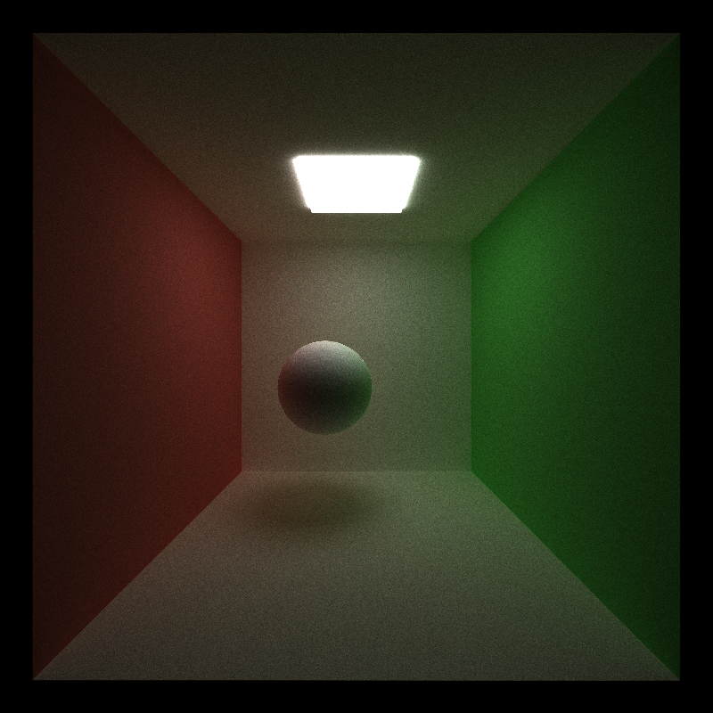
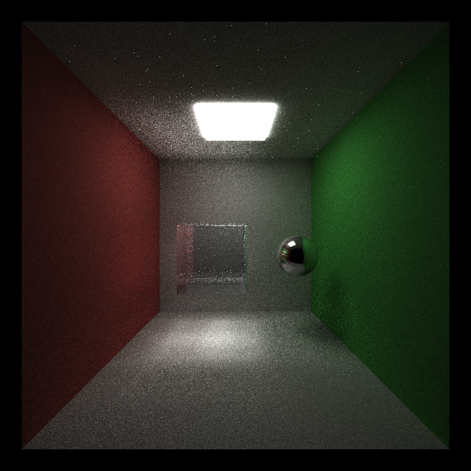
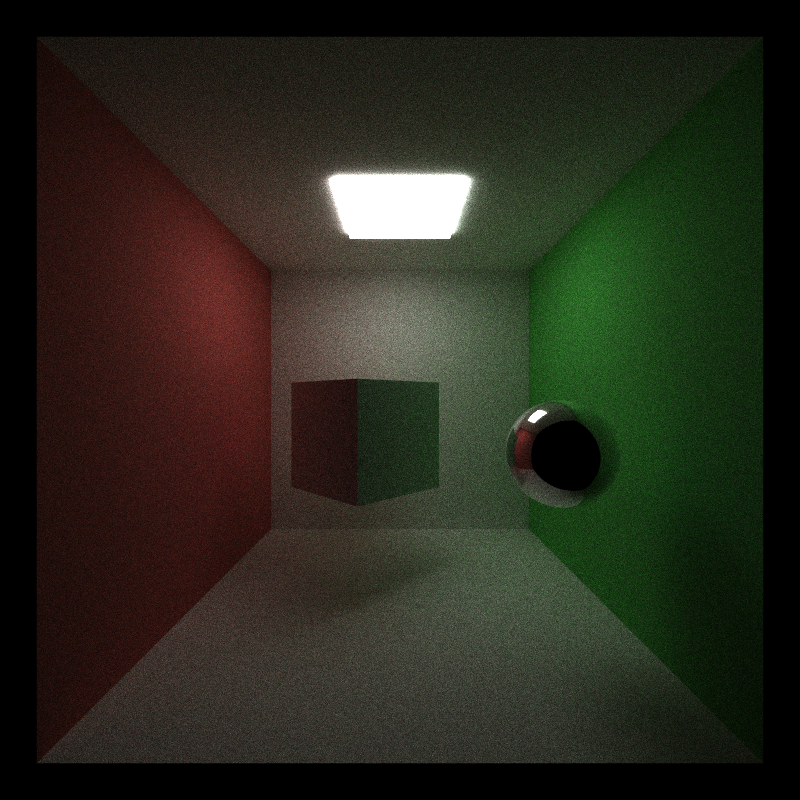
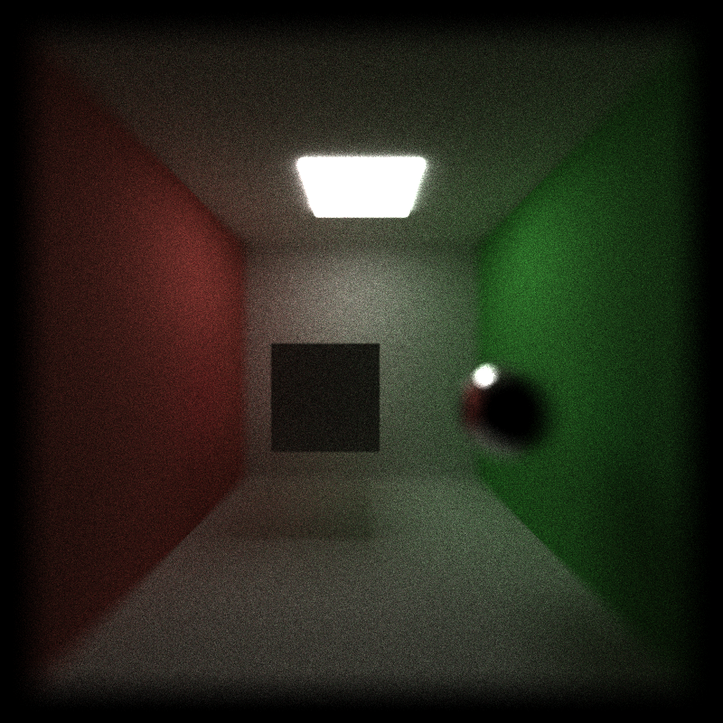
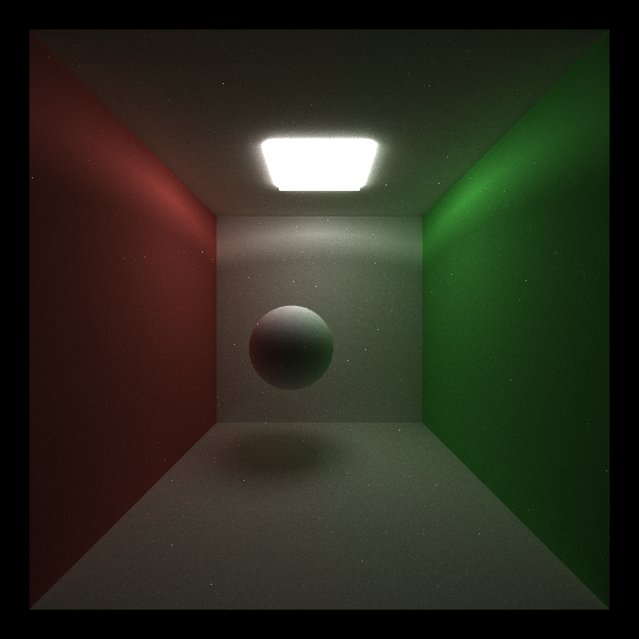
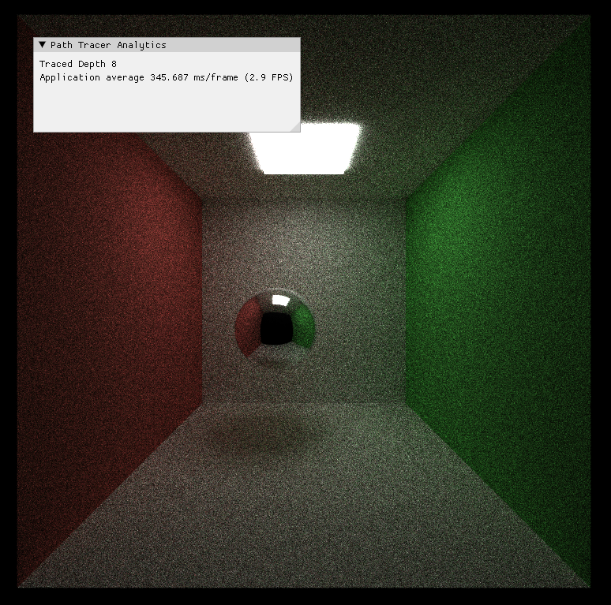
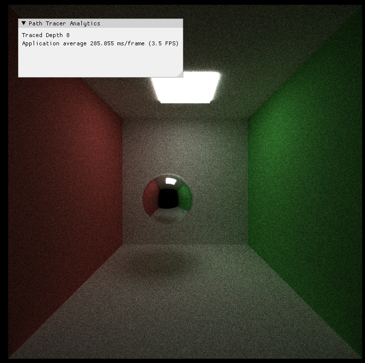

# University of Pennsylvania, CIS 5650: GPU Programming and Architecture
## Project 3 - CUDA Path Tracer

* Zwe Tun
  * LinkedIn: https://www.linkedin.com/in/zwe-tun-6b7191256/
* Tested on: Intel(R) i7-14700HX, 2100 Mhz, RTX 5060 Laptop

## Overview 
Path tracing is a rendering technique that produces realistic images by simulating how light travels through a scene. Instead of just tracing rays directly to light sources, it sends rays from the camera that bounce around surfaces, picking up color and brightness based on the material they hit. The downside is that the images start out noisy since the method relies on randomness, but with enough samples the noise fades and the image converges to a natural, physically accurate result.

## Core Features
Cosine-weighted Diffuse Scatter BRDF

Contiguous Material Type Memory

Stream Compaction

Stochastic Sampled Antialiasing

## Visual Improvements

### Refraction

To achieve realistic glass and Fresnel effects in rendering, both Snell’s Law and total internal reflection (TIR) are applied. The process begins by calculating the angle of incidence using the dot product between the incoming ray and the surface normal. The material’s index of refraction (IOR) determines how much light bends as it enters or exits the medium. Using this value, we can check whether the ray undergoes total internal reflection, where all light is reflected rather than transmitted. To estimate the ratio of reflected to refracted light, Schlick’s approximation is applied and compared against a random uniform number generator to select reflection or refraction. Finally, Snell’s Law is used to compute the precise direction of the refracted ray as it passes through the surface.

Refraction is more expensive than simple BSDF scattering since it must compute reflection and refraction using Snell’s Law and Schlick’s approximation. A CPU version would perform worse, as these calculations benefit from GPU parallelism. Running them one ray at a time would be inefficient. To improve performance and reduce the noticeable noise and bright “firefly” artifacts future work could use better sampling and clamp bright samples. 

### Physically-based depth-of-field

To simulate realistic camera depth of field, we jitter rays within a circular aperture to mimic how real lenses focus light. First, we determine the focal distance between the camera and the subject. Using the lens radius, we then sample a random point on the lens surface using a uniform random number generator. Next, we compute the corresponding focus point on the focal plane, ensuring all rays passing through the sampled lens point converge at this focus. By offsetting the ray’s origin to the sampled lens position and adjusting its direction toward the focus point, we create the appearance of blurred backgrounds and foregrounds. The lens radius controls the strength of this effect larger radii produce shallower depth of field (more blur), while smaller radii keep more of the scene in focus.

The performance impact of this feature was minimal, as the additional ray jitter and focal calculations are lightweight compared to overall path tracing operations. There was no significant change in FPS. In terms of a CPU version, it would perform worse since the random lens sampling per ray benefits from GPU parallelism. In the future there could be support for variable aperture shapes. Currently the implementation only supports a circular thin lens model. 

*Before DOF*

&nbsp;
&nbsp;

*After DOF* 

### Direct lighting

In our core path tracer, rays are traced from the camera into the scene and followed as they bounce until eventually reaching an emissive surface, such as a lamp or ceiling light. Direct lighting enhances this process by allowing rays to explicitly sample light sources instead of relying solely on random bounces to reach them. At each surface intersection, the renderer generates a shadow ray toward the light source to check if the path is unobstructed. If the shadow ray reaches the light without being blocked, that point receives direct illumination. This technique greatly improves realism and reduces noise by efficiently capturing the primary lighting contribution from visible light sources.

After implementing direct lighting, the frame rate decreased from 4.3 FPS to 3.5 FPS, representing roughly a 19% drop in performance. This slowdown occurs because each surface interaction now spawns an additional shadow ray, effectively increasing the total number of ray–scene intersection tests per frame

If implemented on a CPU, performance would suffer even more, as CPU are not optimized to handle multiple paraellel computations unlike the GPU. 

Future optimizations could include light sampling heuristics to limit the number of shadow rays per bounce, or sampling based on light intensity. These improvements could help regain performance while preserving the accuracy and realism of the lighting.

*Before Direct Lighting*

&nbsp;
&nbsp;

*After Direct Lighting*

## Performance Improvements 

### Russian Roulette 

Not all rays contribute equally to the final rendered image, so we can terminate certain rays early to save computation. This is especially useful for rays with low energy that have lost most of their contribution after multiple bounces. We use a uniform random number generator to probabilistically decide whether a ray should be terminated by setting its remaining bounces to zero. To preserve the accuracy of primary lighting, Russian Roulette is only applied after the first two bounces, as early bounces are typically more important for scene illumination. If a ray survives this probabilistic test, its color is scaled down to maintain energy conservation and to increase the chance of termination in subsequent iterations. This technique reduces computational cost while keeping the rendered result unbiased.

*Before Russian Roulette*

&nbsp;
&nbsp;

*After Russian Roulette*

As we can see, after applying Russian Roulette, our frame rate increased by approximately 20%, improving from 2.9 FPS to about 3.5 FPS.

### Performance Analysis 

### Bloopers

## Resources 
https://www.cg.tuwien.ac.at/sites/default/files/course/4411/attachments/04_path_tracing.pdf

https://www.scratchapixel.com/lessons/3d-basic-rendering/global-illumination-path-tracing/global-illumination-path-tracing-practical-implementation.html

[PBRTv3] Physically Based Rendering: From Theory to Implementation (pbr-book.org)

[PBRTv4] Physically Based Rendering: From Theory to Implementation (pbr-book.org)
